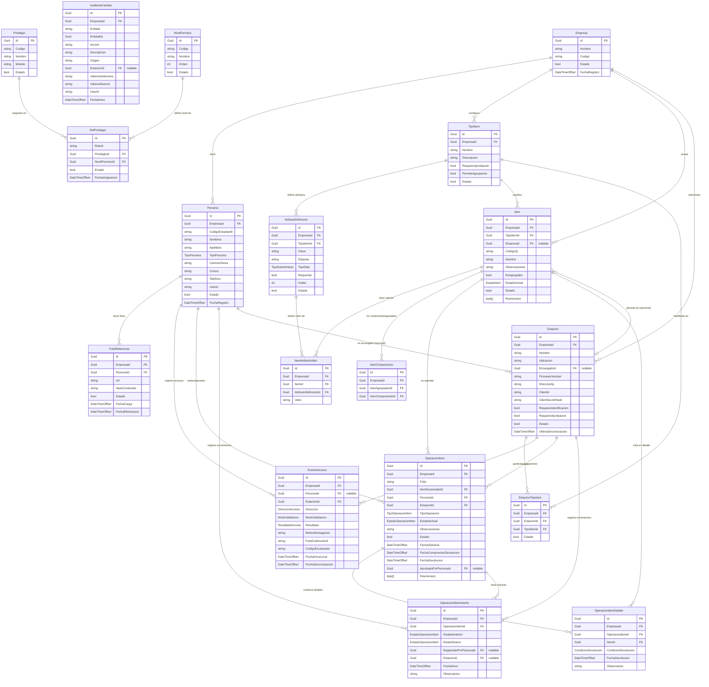

# Sistema de Identificación Automática (SIA)

Plataforma integral para el control de accesos, gestión de inventario/préstamos y sincronización con estaciones físicas inteligentes, impulsada por reconocimiento facial con inteligencia artificial y credenciales QR/NFC.

---

## Tabla de Contenidos
1. [Descripción General](#descripción-general)
2. [Arquitectura del Sistema](#arquitectura-del-sistema)
3. [Módulos y Funcionalidades](#módulos-y-funcionalidades)
4. [Tecnologías Utilizadas](#tecnologías-utilizadas)
5. [Estructura del Repositorio](#estructura-del-repositorio)
6. [Instalación y Configuración](#instalación-y-configuración)
   - [Requisitos Previos](#requisitos-previos)
   - [Configuración del Backend (.NET 9)](#configuración-del-backend-net-9)
   - [Configuración del Frontend (React + Vite)](#configuración-del-frontend-react--vite)
7. [Endpoints Principales de la API](#endpoints-principales-de-la-api)
8. [Seguridad y Control de Acceso](#seguridad-y-control-de-acceso)
9. [Modelo de Datos (ER)](#modelo-de-datos-er)

---

## Descripción General

El **Sistema de Identificación Automática (SIA)** es una solución empresarial diseñada para instituciones educativas y corporativas que requieren:
- Control de ingreso y salida peatonal/vehicular de alta velocidad mediante escaneo de credenciales QR/NFC y doble factor biométrico facial.
- Gestión y trazabilidad de inventario, equipos y laboratorios (préstamos, devoluciones y aprobación en tiempo real).
- Monitorización y sincronización bidireccional con estaciones de hardware físicas (terminales y quioscos inteligentes).
- Panel de control administrativo con auditoría completa de eventos y métricas operativas.

---

## Arquitectura del Sistema

El proyecto sigue una arquitectura desacoplada y modular:

- **Backend:** Desarrollado bajo los principios de **Clean Architecture** (Arquitectura Limpia) y diseño guiado por el dominio (DDD) en **.NET 9 (C#)**.
- **Frontend:** SPA moderna construida con **React 19**, **TypeScript** y **Vite**, estructurada bajo la metodología **Atomic Design** (Atoms, Molecules, Organisms, Templates y Pages) con un sistema de diseño propio basado en CSS Tokens.
- **Multi-Tenant:** Aislamiento de datos mediante `EmpresaId` y filtros globales de consulta en Entity Framework Core.

```
┌─────────────────────────────────────────────────────────────┐
│                    Frontend SPA (React)                     │
│    Dashboard │ Accesos │ Operaciones │ Personas │ Roles     │
└──────────────────────────────┬──────────────────────────────┘
                               │ HTTPS / REST (JWT)
┌──────────────────────────────▼──────────────────────────────┐
│                    API Gateway / Sia.Api                    │
└───────┬──────────────────────┬──────────────────────┬───────┘
        │                      │                      │
┌───────▼────────┐     ┌───────▼────────┐     ┌───────▼────────┐
│ Sia.Application│     │Sia.Infrastruct.│     │   Sia.Domain   │
│   (Casos de    │     │(EF Core, Azure,│     │  (Entidades,   │
│    Negocio)    │     │    FaceONNX)   │     │    Enums)      │
└───────┬────────┘     └───────┬────────┘     └────────────────┘
        │                      │
        ▼                      ▼
┌───────────────┐      ┌───────────────┐      ┌────────────────┐
│  SQL Server   │      │ Azure Storage │      │ Modelos ONNX   │
│  (Persistencia│      │   (Fotografías│      │ (Reconocimiento│
│  Relacional)  │      │ y Biometría)  │      │    Facial)     │
└───────────────┘      └───────────────┘      └────────────────┘
```

---

## Módulos y Funcionalidades

### 1. Control de Accesos
- Registro de eventos en tiempo real (Ingreso / Egreso).
- Métodos de autenticación: QR, NFC, Facial (1:1 con verificación de similitud coseno).
- Soporte para validaciones offline y sincronización diferida por lotes.
- Simulador de eventos integrado para pruebas de integración.

### 2. Gestión de Préstamos e Inventario
- Catálogo de ítems físicos con categorización dinámica y atributos personalizados.
- Estados de inventario: *Disponible*, *En préstamo*, *Mantenimiento*, *Baja*.
- Flujo de solicitudes y aprobación/rechazo de préstamos con notas y fechas límite de devolución.

### 3. Administración de Personas y Credenciales
- Registro de usuarios, estudiantes, personal administrativo y docentes.
- Generación y asignación de credenciales QR y enrolamiento de fotos para biometría.
- Drawer interactivo de expediente (ficha de persona, historial de accesos y préstamos activos).

### 4. Estaciones Físicas
- Alta, configuración y supervisión de estaciones de lectura.
- Monitoreo de estado de conexión (*En línea*, *Desconectada*, *Sincronizando*) mediante latidos (*heartbeats*).

### 5. Roles y Seguridad Granular
- Matriz de permisos por módulos institucionales.
- Creación guiada de roles con permisos de lectura, escritura, modificación y eliminación.

### 6. Auditoría y Reportería
- Registro de auditoría de todas las acciones del sistema con exportación en formatos estándar (CSV/Excel).
- Métricas e indicadores clave de rendimiento (KPIs) en tiempo real.

---

## Tecnologías Utilizadas

### Backend
- **Framework:** .NET 9 (C# 13)
- **Acceso a Datos:** Entity Framework Core 9
- **Base de Datos:** Microsoft SQL Server
- **Seguridad:** ASP.NET Core Identity + JWT Bearer Tokens
- **Visión por Computadora:** FaceONNX (Redes neuronales ResNet & RFB para detección y extracción de *embeddings* faciales)
- **Almacenamiento Cloud:** Azure Blob Storage SDK

### Frontend
- **Librería UI:** React 19 + TypeScript
- **Empaquetador y Dev Server:** Vite
- **Enrutamiento:** React Router DOM v6
- **Estilos:** Vanilla CSS con CSS Tokens (Dark Theme moderno con efectos de glassmorphism y microinteracciones)
- **Componentes:** Atomic Design System modular

---

## Estructura del Repositorio

```text
├── API/                               # Solución Backend (.NET 9)
│   ├── src/
│   │   ├── Sia.Domain/                # Entidades del dominio, enums y reglas base
│   │   ├── Sia.Application/           # DTOs, interfaces y servicios de negocio
│   │   ├── Sia.Infrastructure/        # EF Core, Identity, FaceONNX, Azure Storage
│   │   └── Sia.Api/                   # Controladores REST, middlewares y configuración
│   ├── tests/                         # Pruebas unitarias y de integración
│   └── Sia.sln                        # Solución de Visual Studio / .NET CLI
│
├── frontend/                          # Aplicación Web SPA (React + Vite)
│   ├── src/
│   │   ├── components/
│   │   │   ├── atoms/                 # Botones, inputs, badges, selectores
│   │   │   ├── molecules/             # Tablas, campos de búsqueda, modales base
│   │   │   ├── organisms/             # Drawers, cabeceras, formularios complejos
│   │   │   └── templates/             # Layouts de autenticación y dashboard
│   │   ├── context/                   # Proveedores de estado (Toast, Auth, etc.)
│   │   ├── pages/                     # Vistas principales del sistema
│   │   ├── services/                  # Clientes de API y persistencia local
│   │   ├── types/                     # Definiciones de TypeScript
│   │   ├── App.tsx                    # Componente raíz
│   │   ├── index.css                  # Sistema de diseño global y tokens CSS
│   │   └── main.tsx                   # Punto de entrada
│   ├── package.json
│   └── vite.config.ts
│
└── README.md                          # Documentación del proyecto
```

---

## Instalación y Configuración

### Requisitos Previos
- [.NET 9 SDK](https://dotnet.microsoft.com/download/dotnet/9.0)
- [Node.js (v18 o superior)](https://nodejs.org/) y npm
- Servidor [SQL Server](https://www.microsoft.com/sql-server) (local o instancia en nube)

---

### Configuración del Backend (.NET 9)

1. Navegar a la carpeta del backend:
   ```bash
   cd API
   ```

2. Configurar la cadena de conexión y parámetros en `appsettings.json` o mediante User Secrets:
   ```json
   {
     "ConnectionStrings": {
       "DefaultConnection": "Server=localhost;Database=SiaDb;Trusted_Connection=True;TrustServerCertificate=True;"
     },
     "Jwt": {
       "Key": "TU_CLAVE_SECRETA_SUPER_SEGURA_DE_AL_MENOS_32_CARACTERES",
       "Issuer": "SiaApi",
       "Audience": "SiaClients"
     },
     "Almacenamiento": {
       "ConnectionString": "UseDevelopmentStorage=true",
       "Contenedor": "fotos-personas"
     },
     "ReconocimientoFacial": {
       "RutaModelos": "modelos",
       "UmbralSimilitud": 0.65,
       "TimeoutMs": 5000
     }
   }
   ```

3. Aplicar las migraciones a la base de datos:
   ```bash
   dotnet ef database update --project src/Sia.Infrastructure --startup-project src/Sia.Api
   ```

4. Compilar y ejecutar la API:
   ```bash
   dotnet run --project src/Sia.Api
   ```
   *La API estará disponible en `https://localhost:7001` (o el puerto configurado).*

---

### Configuración del Frontend (React + Vite)

1. Navegar al directorio de frontend:
   ```bash
   cd frontend
   ```

2. Instalar las dependencias:
   ```bash
   npm install
   ```

3. Iniciar el servidor de desarrollo:
   ```bash
   npm run dev
   ```
   *La aplicación estará accesible en `http://localhost:5173`.*

4. Generar el paquete de producción:
   ```bash
   npm run build
   ```

---

## Endpoints Principales de la API

| Módulo | Método | Endpoint | Descripción |
|---|---|---|---|
| **Auth** | `POST` | `/api/auth/login` | Inicio de sesión con usuario y contraseña |
| **Auth** | `POST` | `/api/auth/login-qr` | Inicio de sesión rápido mediante código QR |
| **Estación** | `POST` | `/api/estacion-api/validar` | Validación en tiempo real de acceso (QR/Facial) |
| **Estación** | `POST` | `/api/estacion-api/sync/eventos` | Sincronización en lote de eventos offline |
| **Estación** | `POST` | `/api/conexion/heartbeat` | Registro de latido (*heartbeat*) de estación |
| **Personas** | `GET` | `/api/personas` | Listado paginado y filtrado de personas |
| **Personas** | `POST` | `/api/personas` | Creación y enrolamiento de nueva persona |
| **Ítems** | `GET` | `/api/items` | Catálogo de ítems y estado de inventario |
| **Operaciones**| `POST` | `/api/operaciones` | Creación de solicitud / registro de préstamo |
| **Operaciones**| `PUT` | `/api/operaciones/{id}/aprobar` | Aprobación de operación de préstamo |
| **Auditoría** | `GET` | `/api/auditoria` | Consulta del registro de auditoría del sistema |
| **Reportes** | `GET` | `/api/reportes/dashboard` | Métricas y estadísticas consolidadas |

---

## Seguridad y Control de Acceso

- **Protección de Endpoints:** Autenticación obligatoria mediante Bearer JWT con roles y niveles de permiso granulares.
- **Trazabilidad:** Registro inmutable de cada solicitud en el módulo de auditoría.
- **Biometría Segura:** Los vectores de características faciales (*embeddings*) y las imágenes de referencia se procesan y almacenan bajo políticas de acceso controlado.

---

## Modelo de Datos (ER)

A continuación se presenta el diagrama Entidad-Relación basado en los modelos del dominio de la aplicación (`Sia.Domain/Entidades`).


